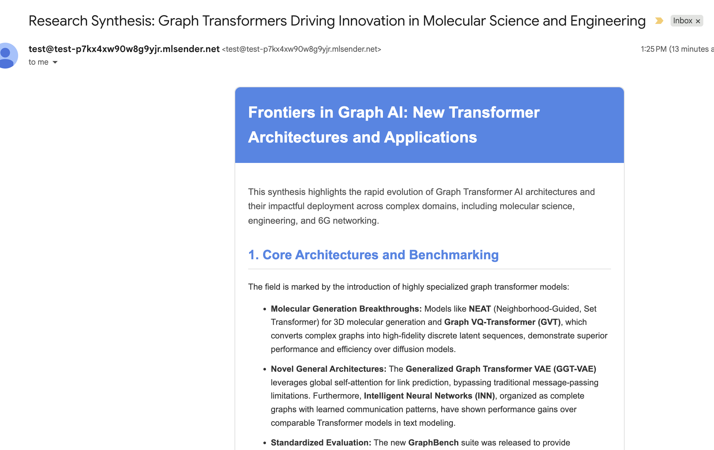

# Research assistant

[](https://github.com/nenuadrian/google-agents/actions/workflows/python-package.yml)

https://nenuadrian.com/uom/gdg/2025/workshop/



## Agent Interaction and Data Flow

The research assistant operates as a sequential pipeline, orchestrating multiple agents to gather, synthesize, and deliver research information.

```ascii
+-----------------------------+
| (START)                     |
|  sequential_pipeline_agent  |
+--------------+--------------+
               |
               v
+-----------------------------+
| Step 1: parallel_research_agent |
+--------------+--------------+
               |
  +------------+------------+
  |                         |
  v                         v
+-----------------+     +----------------------+
|  google_agent   |     | arxiv_research_agent |
+-----------------+     +----------------------+
  |       |                 |        |
  |       v                 |        v
  | [ Google Search ]       |  [ arXiv API ]
  |                         |
  | "google_research_result"| "arxiv_research_result"
  |                         |
  +------------+------------+
               |
               v
+-----------------------------+
| Step 2:      merger_agent     |
+-----------------------------+
               |
               | (Synthesizes results)
               | "Synthesized Report & Subject"
               v
+-----------------------------+
| Step 3:      email_agent      |
+-----------------------------+
               |
               | (Generates & sends HTML email)
               v
+-----------------------------+
|        [ SMTP Server ]        |
+-----------------------------+
               |
               v
+-----------------------------+
|       (END) User's Inbox      |
+-----------------------------+
```

## Install

```bash
# Python Env
python -m venv .venv
source .venv/bin/activate

# OR Conda - feel free to use anything, e.g. Poetry, Pipenv, etc.
conda create -n agents python=3.11 -y
conda activate agents

pip install google-adk

# Create an API key on https://aistudio.google.com/api-keys

# Create base project: 1) gemini-2.5-flash, 1) Google AI Studio, provide the Key
adk create adk-research-assistant
cd adk-research-assistant
```

Add to .env the model to use:

```bash
GEMINI_MODEL=gemini-2.5-flash
```

## Simple arxiv agent

```bash
pip install arxiv
```

## Simple email agent

Make an account on [mailersend.com](https://www.mailersend.com/), get SMTP credentials.
Add them to the `.env` file.

```bash
SMTP_DEFAULT_PORT=587
SMTP_HOST="smtp.mailersend.net"
SMTP_USERNAME=""
SMTP_PASSWORD=""
FROM_ADDR="test@DOMAIN_GENERATED"
TO_ADDR="YOUR_EMAIL"
```

```bash
pip install secure-smtplib
```
